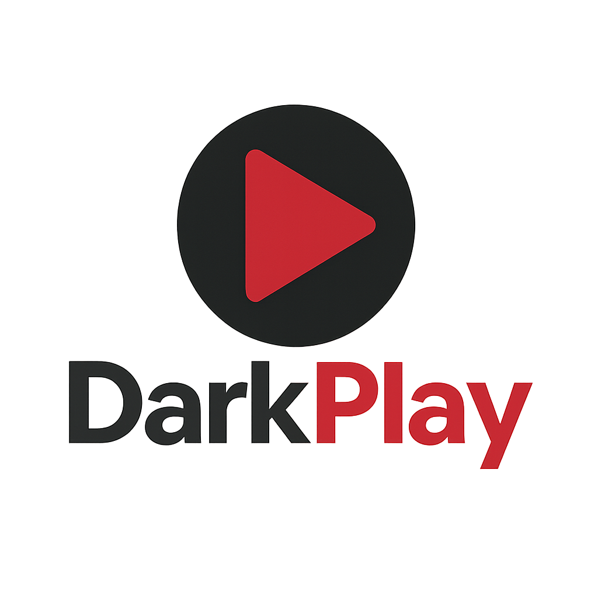

<div align="center">
  
  
  # DarkPlay Media Player
  
  *Modern Qt 6 media player with optimized architecture*
  
  [](LICENSE)
  
  
</div>

## Features

- 🎥 Stable video playback without artifacts
- ⚡ Hardware acceleration with OpenGL
- 🔧 Extensible plugin architecture  
- 🌐 Cross-platform (Linux, Windows, macOS)
- 🎨 Modern Qt 6 interface with themes

## Quick Start

**Requirements:** Qt 6, CMake 3.31+, C++20 compiler

```bash
git clone <repository-url>
cd DarkPlay
mkdir build && cd build
cmake .. && cmake --build . -j$(nproc)
./cmake-build-debug/DarkPlay
```

## Controls

- **Space** - Play/Pause
- **F11** - Fullscreen
- **Left/Right** - Seek
- **Right-click** - Context menu

## License

MIT License
